# 기말고사 정리

## 개념 정리

- 범위 13강~25강

### Transformation Pipeline

- 객체 좌표계 -> 카메라 좌표계 -> 화면 좌표계
  - Modeling Coordinates
    - (Model Transform)local to world
  - World Coordinates
    - (View Transform)world to camera
  - Normalized Coordinates
    - (Projection Transform)camera to screen

로컬, 모델 좌표계에서 월드 좌표계로 이동 (Model Transform)

월드 좌표계에서 카메라 좌표계로 이동 (View Transform)

카메라 좌표계에서 화면 좌표계로 이동 (Projection Transform)

이 과정은 4x4 행렬로 표현된다.

### Instance Transformation

- 모델링 좌표계에서의 변환
  - 이동, 회전, 스케일링

### Hierarchical Modeling

일종의 트리 구조로 모델링을 한다.

### Current Transformation Matrix

일명 CTM

- 현재 변환 행렬
  - 현재 변환 행렬을 곱해주면 된다.

모델 뷰와 projection 행렬에서 사용한다.

### The lookAt Function

- gluLookAt(ex, ey, ez, cx, cy, cz, ux, uy, uz)
  - ex, ey, ez : eye position
  - cx, cy, cz : focus position
  - ux, uy, uz : up vector
- 월드 프레임을 카메라 프레임으로 변환
  - Compose a rotation R with translation T
  - T를 사용하여 회전 R을 구성한다.
  - W = T R
- 보기 변환 V를 얻기 위해 W를 반전시킨다.
  - V = W^-1 = R^-1 T^-1

### World Frame to Camera Frame

- 카메라 포인트는 z축을 따라 -1로 이동한다.
- n방향은 f-e 방향으로 정규화한다.

### Projection Matrices

프로젝션은 3차원 공간을 2차원 공간으로 변환한다.

투영은 되돌릴 수 없다.

4x4 행렬로 표현된다.

동형 좌표가 중요함

평행 및 원근 투영이 있다.

### Parallel Projection

평행선을 통해 3D 객체를 2D로 투영한다.

*선들이 사영에 반드시 직교하는 것은 아니다.*

- 불가능한 문제로 이어질 수 있다.

### Orthographic Projection

- 단순하게 2D로 투영하기에 단순하지만 현실적이지 않다.
- 주로 2D 도면을 만들 때 사용한다.

4x4 행렬에서 z축을 0으로 만들어주면 된다. (단순 투영)

openGL에서는 glOrtho()를 사용한다.

- glOrtho(left, right, bottom, top, near, far)
  - left, right : x축의 범위
  - bottom, top : y축의 범위
  - near, far : z축의 범위

이 과정에서 Normalizetion이 일어난다.

### Orthogonal Matrix

- 가장 먼저 Centering을 한다. (원점으로 중심이동)
  - T(-(left+right)/2, -(bottom+top)/2, -(near+far)/2)
  - 마지막인자를 near로 하는 경우도 있다.
- Scaling을 한다. (정규화)
  - S(2/(right-left), 2/(top-bottom), 2/(far-near))

### Perspective Projection

단순한 시각으론 원점을 2D상에 투영하는 것

시점에 따라 분리될 수 있음 (탑뷰, 사이드 뷰)

x_p = x/(z/d), y_p = y/(z/d)

4x4 행렬은 그대로 가져가고 z축만 z/d로 변경

opengl에서는 2가지 방식을 지원: glFrustum, gluPerspective

glFrustum(xmin, xmax, ymin, ymax, near, far) 형식으로 2차원 좌표계 2개의 꼭지점과 표현될 요소를 넣을 near와 far로 구성

gluPerspective(fovy, aspectRatio, near, far) 형식으로 종횡비와 각도를 입력받아서 출력

fovy: 사야를 높이 각도로 지정한다.
aspectRatio: 종횡비로 가로 분의 높이로 비율을 계산

표준 뷰 볼륨 속성으론, 카메라는 원점에 위치하고 z축으로 -1을 바라본다. 카메라가 cilpping할 내용은 far/near로 위치하며 최대 값은 -1로 제한한다. (비율로 계산하기에)

fovy를 통해 보일 각도를 지정하는데 먼저, z각도를 scale한다.

far/분의 1로 계산

다음은 x 각도 방향을 스케일링한다.

따라서 삼각함수 공식에 따라 다음과 같은 식이 완성된다.

far/L = tan(0_w/2) => L = far x tan(0_w/2)

x에 대한 스케일링은 1/ far x tan(0_w/2) 

나누기 2를 하는 이유는 삼각혁을 만들기 위해 주어진 시야각에서 /2를 통해 삼각형을 생성

으로 정리된다.

따라서 y 각도 방향에 대한 스케일링도 

1 / far x tan(0_h/2)

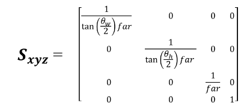

가장 중요한 개념이 정규화, 표준된 표시되는 영역이 정해졌다면 이를 Unhinging transformation을 통해 표시해야 하는 것

- Unhinging transformation는 실제 세계를 2D로 실제화하기 위해서, 원근감을 표현하기 위한 핵심 작업

시작되는 지점은 near / far, 끝나는 지점은 -1

즉, 피라미드 윗 부분의 모양을 2d화면으로 보여주기 위한 작업

parallel view volume

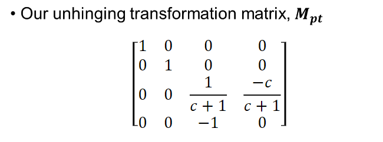

*c는 위에서 계산함*

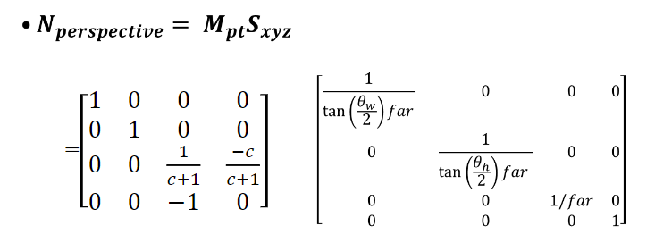

따라서 최종 계산은 해당 영역의 위치한 행렬을 추출하고 이를 정규화? 균일화를 통해 구한다.

언힌지 프로세스의 핵심은 가까운 물체는 크게, 멀리 있는 물체는 더 작게 그리는 것

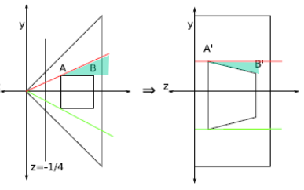

### Lighting

컴퓨터에서 실세계를 잘 표현하기 중요한 요소로 빛을 표현해야 한다.

재료의 특성, 광원 효과등이 잘 표현되어야 함

이러한 그래픽 모델을 lighting model, Shading model이라고 함

물체 표면의 조명 위치, 색상을 결정surface-rendering method은 장면의 모든 투영된 위치에 대한 픽셀 색상을 결정

- 빛의 형태
  - Point 한점에서 발생 전구같은
  - Infinitely distance light 태양과 같은 방향과 값 고정
  - Directional light sources 스포트라이트, 손전등
  - Area light 천장 형광등

방향 빛에 대해서 중심에서 얼마나 멀어지는 것에 대한 각도도 쉽게 계산 가능

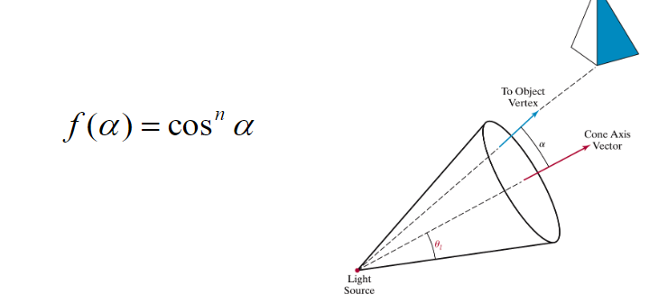

조명 모델은 다양한 광학 특성을 이용하여 표면의 조명 효과를 계산

퐁 모델은 반사되는 방식을 설명하는 것으로 Diffuse, ambient, specular에 대해서 쉽게 계산하게 해준다.

표면 타입에 따라 반사되는 방식이 다르다. (매끄러우면 방향이 한 방향으로 이뤄지지만 울퉁불퉁할수록 사방으로 튄다.)

#### Phong Model

- Diffuse
- Specular
- Ambient

##### Diffuse

입사각은 들어온 방향에 대해서 각도가 계산되어 동일한 각도로 산란된다. 이를 확산 반사, 램버트 반사기라고도 함

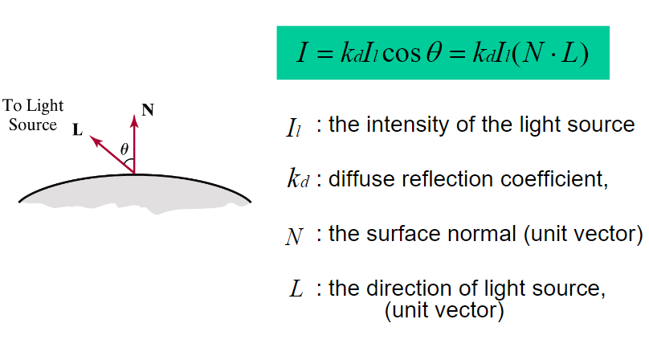

##### Ambient Light

주변 물체는 셀수 없는 반사가 이뤄져 어느정도 균일한 조명이 나타나게 된다. (시야 방향 및 표면의 공간 방향과 무관한 난반사 형태)

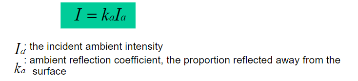

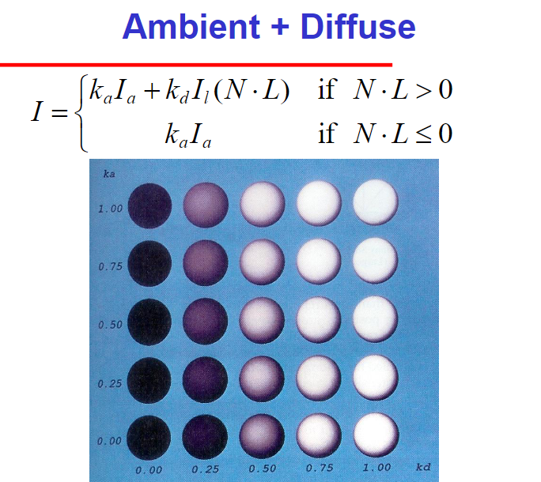

*합친 모습*

##### Specular Reflection

반사각과 입사각이 동일한 방향으로 모든 빛을 반사한다. (거울)

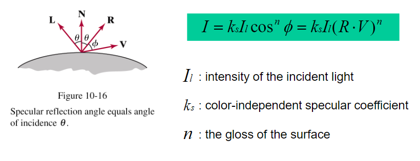

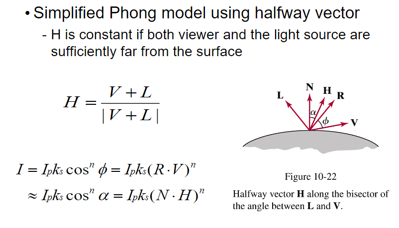

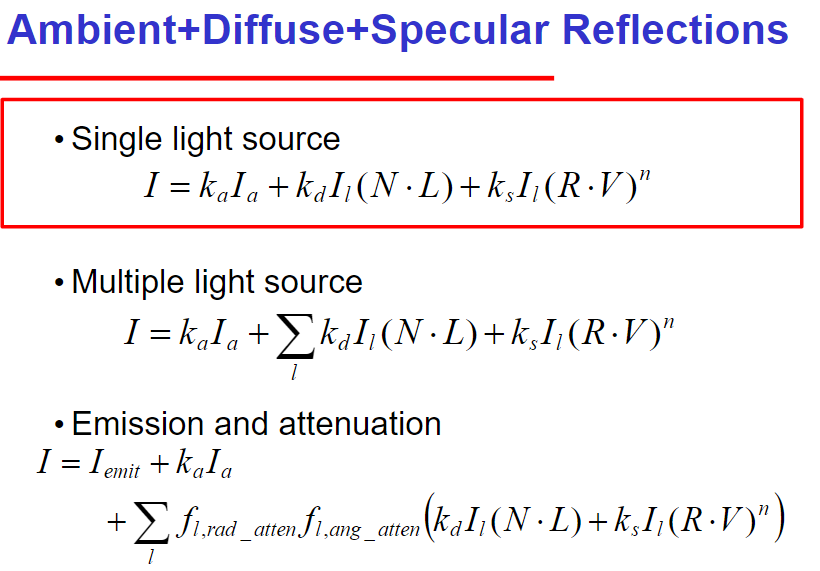

모든 퐁 모델 적용

#### OpenGL Shading

필요한 것: 노말값, 재질값, 빛 정보

##### Normal for Triangle

오른손 자표계 기준으로 노멀 계산 방법

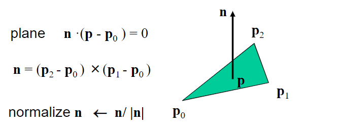

자표계 기준에 따라 변경된다.

##### Polygon Rendering Methods

원은 폴리건으로 이뤄지기 때문에 매끄럽게 표현되어야 한다.

따라서 각 삼각형은 하나의 정규분포 normal값을 가지므로 퐁 모델에 의해 생성된 음영으로 표현이 가능하다.

하지만 그렇다고 해서 평평한 표현이 되는 것이 아니므로 각 꼭지점에 대한 새로운 법선을 생성한다.

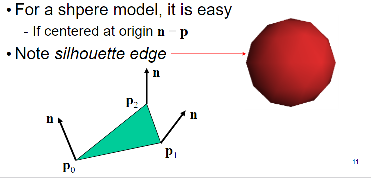

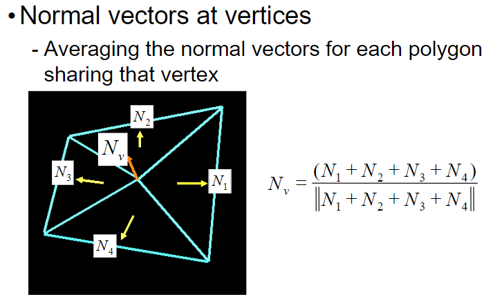

##### Applying Phong Model in two different ways

퐁 모델을 각 vertex에 설정하면 Gouroud shading

퐁 모델을 각 fragment마다 설정하면 Phong Shading

##### Gouraud shading

다각형 메쉬로 근사화된 곡면 렌더링

절차.
1. 각 정점에서 평균 단위 정규 벡터 결정
2. 각 다각형 꼭짓점에서 조명 모델을 적용하여 해당 위치의 빛 세기를 구합니다
3. 다각형의 투영 면적에 대한 정점 강도를 선형 보간

각 vertex에 대해서 수행되며 속성을 통해 전달 가능 하지만, 부정확한 경우가 있을 수 있다.

##### Phong Shading

다각형 각 정점에 대한 정규화

절차
1. 각 정점에서의 평균 단위 법선벡터 결정
2. 다각형의 투영 면적에 대하여 정점 정규분을 선형 보간한다
3. 스캔 라인을 따라 위치에 조명 모델을 적용하여 픽셀 강도를 계산합니다

##### Gouraud versus Phong Shading

Gouraud의 경우 각 정점에 대해서만 수행하기에 Phong보다 빠르다.

OLD OpenGL은 Gouraud을 지원한다.

그에 반해 Phong은 더 느리지만 훨씬 정확하다. 이는 Fragment Shader를 통해 구현 가능하다.

구로드 쉐이딩
- 각 정점에서 평균 정규 분포 찾기(정규 분포)
- 각 꼭짓점에 퐁 모형 적용
- 각 다각형에 걸쳐 꼭지점 음영을 보간합니다

퐁 쉐이딩
- 꼭짓점 정규분포 찾기
- 모서리에 걸쳐 정점 정규 분포를 보간
- 다각형 전체에 걸쳐 에지 정규 분포 보간
- 각 조각마다 퐁 모형 적용

### Texture

표면에 정보를 추가하는 방법에는 두가지가 있다.

- 많은 다각형에 표면을 모형화하는 것(랜더링 속도가 저하, 미세한 기능 불가능)
- 표면에 텍스터 매핑 (하드웨어에 효율적이며, 복잡성이 영향을 주지 않음)

기본적으로 텍스처는 bitmap형태로 이미지 라이브러리를 사용하여 메모리에 로드할 수 있다.

- 2D Array사용 (`char texture[height][width][4]`)
- 1D의경우 `char texture[4*height*width]`

uv좌표계 사용

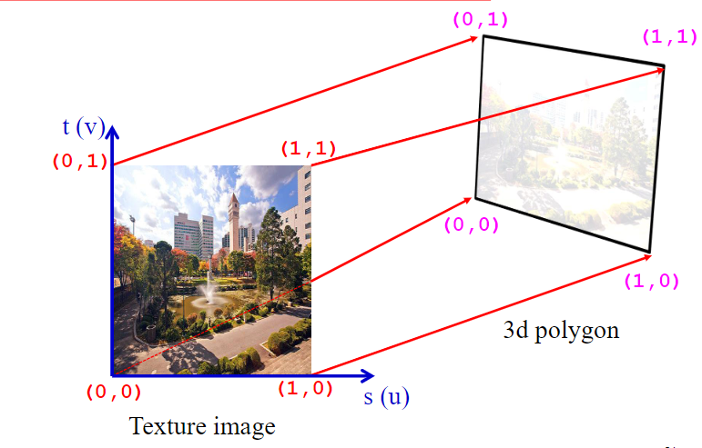

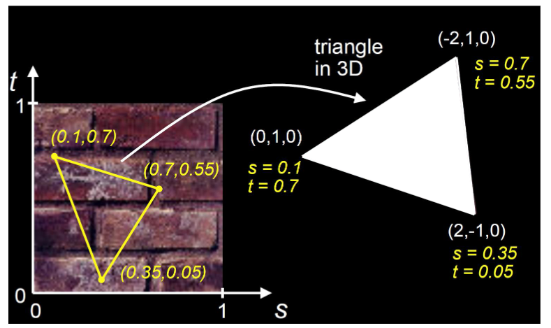

- GL_REPEAT
  - 1,1최대 값을 넘어갈 때 해당 텍스처 반복
- GL_CLAMP
  - 최대 값, 최소 값 고정

이러한 맵핑 기술은 랜더링 파이프라인 끝에서 구현된다.

가장 먼저 2D 이미지를 3D 표면에 붙이기 위해선 텍스처 좌표에서 한 점으로 매핑을 생각해야 한다. (각 좌표가 대응될 수 있도록)

반대로 생각하면 더 유리하다?

픽셀이 주어지고 해당 픽셀이 물체 어느지점에 해당되는지

•s = s(x,y,z)
•t = t(x,y,z)

*어렵다.*

이를 해결하기 위한 첫 번째 해결 방법: 중간 표면에 매핑하는 것

#### Cylindrical Mapping

• 표면에 점 P가 주어지면:
• 캡 중 하나에 있으면 캡이 비행기인 것처럼 매핑합니다
• 곡선 표면에 있는 경우:
• 둘레를 둘러싼 점의 위치를 이용하여 다음을 구하여라
• 점의 높이를 사용하여 determine를 결정합니다

정리하면2차원 좌표 원뿔의 반지름에 해당되는 위치 u와 와 v의 위치에 해당하는 좌표값으로 사용

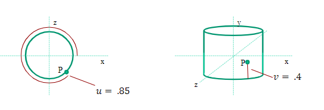

#### Spherical Map

u는 실린더와 똑같이 사용, v의 경우 미리 정의된 0~1 (0.5가 좋음)값을 사용 다음 식의 공식을 사용하여 구한다.

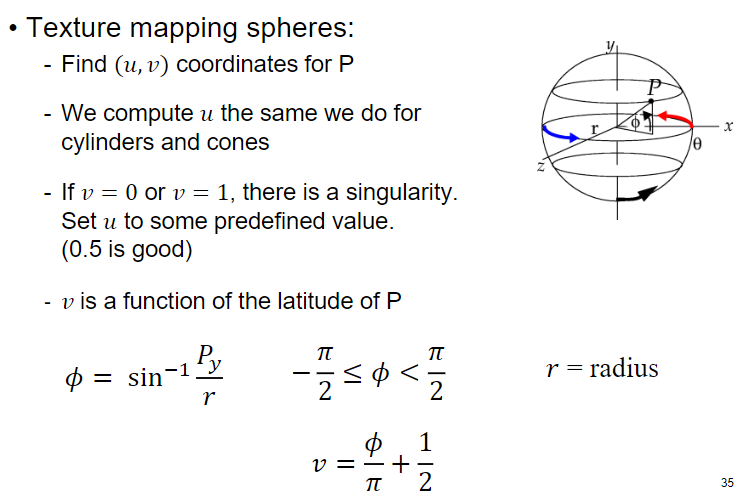

#### Box Mapping

간단하게 정사영 투영으로 구현 가능

환경을 표시하기에 적합 (배경화면 같이)

#### Texture Mapping Complex Geometry

텍스처 매핑을 위해 개체를 프리미티브로 축소해도 올바른 결과를 얻지 못하는 경우가 있다.

*집 모양에서 모서리 부분에 불 연속 발생*

직관적으로는 복잡한 물체에 경계에 구를 배치하여 구할 수 있지만, 바른 방법이 아님

복잡한 물체의 정의되거나 계산된 중심으로부터 교차점까지의 거리를 반지름으로 계산하라. 이것을 𝑢, 𝑣 지도의 반지름으로 사용하라.

각 매핑 기법에 따라 단점과 장점이 존재

원형 매핑은 꼭지점에 대해
실린더는 캡의 불연속이 발생
평면은 한 축이 무너짐

최종 픽셀 색상 = 표준 OpenGL Phong 조명 하에서 질감 색상과 색상의 조합

• GL_Modulate:
질감과 퐁 조명색을 곱하다
• GL_BLEND:
질감과 퐁 조명 색상의 선형 조합
• GL_REPASE:
텍스쳐색상만 사용(퐁조명 무시)

#### OpenGL Texture Mapping

적용하기 위한 기본 3단계

1. 질감을 명시하다
  • 이미지를 읽거나 생성하다
  • 질감을 부여하다
  • 텍스처링을 가능하게 하다
2. 정점에 텍스처 좌표를 할당합니다
  • 적절한 매핑 기능은 응용 프로그램에 맡깁니다
3. 텍스처 매개변수 지정
  • 포장, 필터링

CPU에서 GPU로 보내기 위해 메모리 생성

파라미터 설정
- 범위를 벗어나는 경우 설정
- 필터 모드를 사용하여 점 샘플 대신 면적 평균 사용 가능
- 밉맵핑을 사용하면 여러 해상도로 텍스처를 사용할 수 있습니다
- 환경 매개 변수는 텍스처 매핑이 쉐이딩과 상호 작용하는 방식을 결정합니다

각 좌표에 대한 설정 clamping(CLAMP), wrapping(REPEAT)

다음은 확대 축소

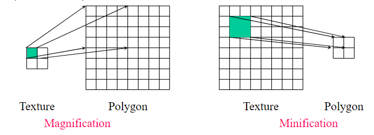

Texture Filtering in Magnification (확대로 텍스처 필터링)

픽셀의 지글지글한 효과를 없을 수 있다.

Minification(최소화)의 텍스처 앨리어싱 문제

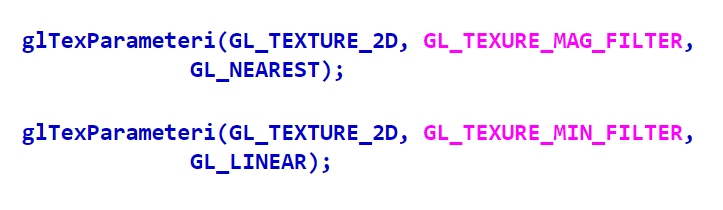

1. 텍스처 개체에 텍스처를 지정합니다
2. 텍스쳐 오브젝트를 바인딩합니다
3. 텍스처 필터 설정
4. 텍스처 랩 모드 설정
5. 텍스처링을 가능하게 하다
6. 정점에 대한 텍스처 좌표를 제공합니다
- 좌표도 생성할 수 있습니다

#### 환경 표현 방법

- Spherical
- Cubic

##### Spherical

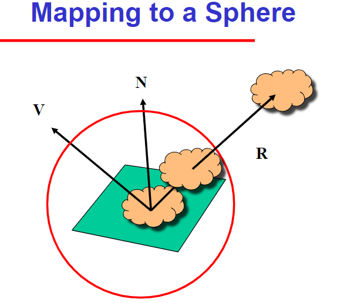

원형의 정면 반사는 모서리 부분이 찌그러지긴 하지만 360도를 다 담을 수 있다.

##### Cube Mapping

단순화된 방법은 입방체 표면의 텍셀에 대한 지표로서 표면 법선을 사용한다

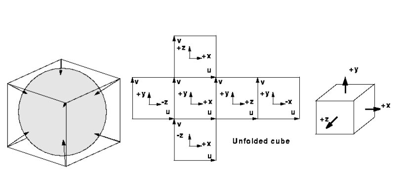

R = (-4, 3, -1). Same as R = (-1, 0.75, -0.25)

정규화 된 값

환경이 개체로 부터 멀리 있다고 가정해야 함

• 객체 사이에 반사가 없습니다.
• 각 개체에 대한 반사 지도가 필요합니다

critical angle of refraction:  반대로 반사되다 일정 값을 넘어가면 정반사로 넘어감

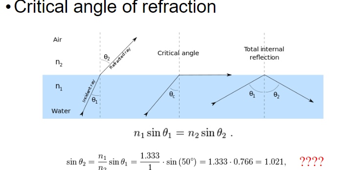

### Bump Mapping

기하학을 사용하지않고 표면에 복잡성을 추가한다.

1. 표면에서 텍스처 로컬 좌표 찾기(u,v,n)
2. normal을 u로, v방향으로 변경한다
3. 새로운 노멀로 퐁 쉐이딩 적용

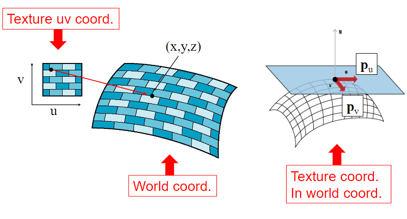

## 문제풀이

### 2016

#### 카메라에서 사용하는 focal length라는 용어의 정의에 대해  간략히  제시하고, 이 값이 클 때와 작을 때 OpenGL에서 사용하는  Field of View(FOV) 값은 각각 대강 어떻게 변하게 되는 지 설명하라.

- 용어의 정의: focal length란, 렌즈의 초점 거리를 나타내며, 찍을 대상의 초점을 맞추는 것으로 초점 거리가 길면 먼 곳의 이미지를 찍을 때, 작으면 축소의 개념으로 이해한다. OpenGL에서는 FOV로 나타내며, 시야각을 뜻한다. 사용자가 볼 화면의 범위를 결정한다.

- Focal Length가 클 때, 작을 때의 상관관계 : 초점 거리가 커지면 상대적인 거리가 감소하므로 확대효과가 나타난다. fov 값이 작아지게 되며 시야각이 좁아지게 된다. 즉 화면에 나타나는 영역이 줄어듬 (멀리 있는 물체를 볼 때 눈을 찡그리는 행위) 반대로 작을 땐, 물체의 상대적인 거리가 증가하므로 확대 효과가 감소한다. fov값은 커지면서 시야각 또한 증가한다.

#### 우리가 물체를 볼 때 가까운 물체는 커져 보이고, 먼 물체는 작아 보이는 원근감이 느껴진다. 원근감이 생기게 되는 근본 원리는 무엇인가? 간단히 설명하라

- 물체를 볼 때 원근감을 느끼는 근본적인 원리는 시각적인 원근법으로 물체를 볼 때, 물체가 거리에 따라 어떻게 위치와 크기가 변하는 것이다.

포인트 투시는 해당 관찰자의 시점으로 해당 물체의 위치, 크기가 변하는 것을 고려하는 것이다.

수렴점은 수평선 상의 수렴점으로 이를 통해 멀리 있는 물체는 멀리있다고 인식하게 된다.

이러한 원리를 통해 우리가 물체의 크기와 위치를 인식할 때 공간의 깊이와 형상을 인지할 수 있게 해준다.

따라서 멀리 있는 물체는 멀리, 먼 물체는 작게 보이게 된다.

#### 다음 그림의 “하이라이트조명”과 같이, 특정 방향과의 사이각 α 에 따라 0도일 때 값이 제일 크며, 각도가 벌어짐에 따라 그  값이 줄어드는 현상을 표현하려고 한다. 이때 사이각에 따라 값의  줄어듦의 정도를 아래 그래프처럼 다양하게 조절하려면 어떤  방식으로 수식을 표현하는 것이 좋겠는가?

$$ f(a) = cos^na $$

#### 구(sphere) 모델의 경우 다음과 같은 Smooth Shading을 하기  위해 필요한 점노말(Vertex  Normal)값은 매우 쉽게 구할 수 있다. 원점을 중심으로 반지름이 1인 구의 경우 vertex normal을 구하는  법을 설명하라.

식은 다음과 같다.

$$ N_v = \frac{(N_1 + N_2 + N_3 + N_4)}{\parallel N_1 + N_2 + N_3 + N_4 \parallel} $$

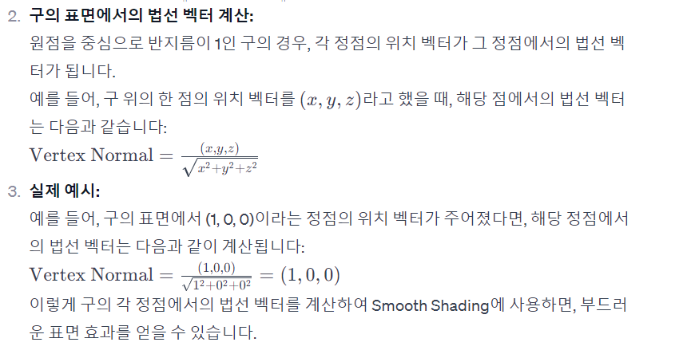 

#### Phong Shading과 Gouraud Shading의 각각의 장단점을 쓰라

Gouraud Shading은 계산이 효율적이고 부드러운 표면을 제공하지만, 광택 효과에 한계가 있습니다.
Phong Shading은 광택 모델링이 우수하나 계산 비용이 높고 부정확한 색상 변화가 발생할 수 있습니다.

그라우드는 각 vertex에 대해 Phong Model을 적용하지만, Phong Shading은 각 Fragment에 대해 적용하기에 이런 트레이드 오프가 발생

#### 광학의 관점에서 금속(metal)과 비금속(non-metal)은 빛이 표면에 닿았을 때 보이는 현상이 확연히 다르다. 어떻게 다른지  간단히 설명하라

금속은 빛을 흡수하는 대신 대부분 반사하기 때문에 광택이나 거울같은 효과를 나타내며, 색상 또한 주변의 영향을 받는다.

비금속의 경우엔 빛을 흡수하며 나머지는 흩뿌리거나 반사한다.  
색상 또한 물체 자체의 색상을 가져간다.

OpneGL에서는 재질로 다룬다.

#### 다음은 Fresnel 현상을 보여주는 그래프이다. 그래프의 가로축과 세로축의 의미를 설명하고 이를 통해 Fresnel 현상이  무엇인지 설명하라

그래픽스에서 반사와 굴절을 계산하기 위해서는 얼마만큼의 빛이 반사되고 얼마만큼의 빛이 굴절되는 것을 계산하는 공식이 Fresnel 공식으로 

가로축이 눈과 노멀방향의 각도이고 세로축이 반사율입니다.보시면 알겠지만 물이나 풀과 같은 비금속 물질들은 수직으로 봤을 때( 0 도 ) 매우 낮은 반사율을 보이며, 수평으로 봤을 때( 90 도 ) 매우 높은 반사율을 보입니다. 비금속같은 금속같은 경우에는 어디에서 보든 0.5 이상의 반사율을 보여 주죠

이를 통해 그래픽스에선 반사율을 표현한다.

#### 구(sphere)위에 texture mapping을 수행하려 한다. 다음 그림과 같이 구 위의 한 점 P 가 주어졌을 때 이 점의 텍스쳐좌표  (u,v)를 구하라.(구의  반지름은  1로  가정하라)

$$ p(p_x, p_y, p_z) $$

v의 경우 미리 정의된 값을 사용하고 u의 경우 아래 공식을 통해 계산한다.

$$ \phi = sin^{-1}\frac{p_y}{r} $$

$$ v = \frac{\phi}{\pi} + \frac{1}{2}$$

#### Texture Mapping이란 단순히 사진을 물체의 표면에 입힌다라는 전통적 의미에서 벗어나. 더욱 확장된 의미로 사용되고 있다. 사용자가 그림을 그릴 때 모델에 관한 정보를 제공해 주는 관점에서 Vertex Attributes들과는 다른 Texture Mapping만이 갖는 장점은 무엇이며,  이를 활용한 대표적인 활용용도를 2가지 이상 제시해보라.

- Texture Mapping은 vertex attributes에 비해 갖는 장점: Texture Mapping은 vertex attributes에 비해 랜더링 속도가 빠르고 미세한 표현이 가능하다. 또한 하드웨어에 효율적이고 복잡성이 영향을 주지 않는다.
- 대표적인 활용용도: Bump Mapping / Normal Mapping과 계산비용이 적지만 높은 시각적 효과를 얻을 수 있다. Environment Mapping은 환경을 쉽게 만들 수 있고 이를 반사시켜 더욱 높은 시각효과가 가능하다.

#### 아래 그림에서 Va점은 조명이 닿는 부분이고 Vb점은 그림자 부분이며 이를 판별하는데 shadaw map이 많이 사용된다. Shadow Map을  통해 어떻게 판별할 수 있는 지 두 점의 경우를 예로 들어 원리를 설명해보라.

보류

### 2017

#### 다음 그림과 같은 로보트팔의 끝을 원하는 곳에 위치하기 위한 관절각을 구하고 싶다. 이를 위한 효과적인 계산방법에 대해 간단히  설명하라.

역운동학(Inverse Kinematics, IK)을 사용할 수 있습니다

이를 계산하기 위해 내부에선 Hierarchical Modeling의 형태를 CTM으로 관리하여 각 관절간의 부모 자식의 기준을 잡고 역운동학을 계산하여 구하면 된다.

역 운동학은 설정된 목표 위치를 설정하고, 좌표 변환을 연쇄적으로 수행 후, 역 좌표를 반환한다. (각 관절마다 제약조건이 있음)

#### Homogeneous Coordinate(동차좌표계)가 원근감을 표현하는 데 사용될 수 있는 원리는 무엇인가? 간단히 설명하라

동차좌표계는 4x4행렬로 표현하여 다른 선형 변환연산에 도움이 되는데 (2d로 변환에서) 원근감에선 w요소를 원근감을 표현하기 위해 사용한다. z축을 저장

해당 좌표 x, y, z, w를 w로 나누어 정규 뷰 볼륨에서 원근감을 나타내기 위해서 사용한다.

정리하면 x, y, z, w를 가진 4차원 좌표계지만, 실제는 2D로의 변환을 위해 쓰이며 원근감을 w로 나타낸다고 보면 된다.

#### 카메라가 월드좌표계(world coordinate)에서 다음과 같은 상태로 주어졌을 때, 월드좌표계를 카메라좌표계(camera coordinate)로 변환하는 4x4 view transform matrix를 직접 구하여라

주어진  상황: 카메라의  위치: (2,0,0),  카메라가  바라보는  곳의  위치: (0,0,0), up-vector: (0,1,0)

#### Perspective Transform에서 Unhinging Transform과정은 무엇을 하는 것인지 간단히 설명하라.

Unhinging Transform은 Perspective과정에서 구해진 영역에 대해서 원근감을 넣기 위해 왜곡된 부분을 보정하여 마치 힌지를 피듯이 (피라미드의 윗 부분을 뒷 영역과 마찬가지로 피듯이)
앞에 있는 물체는 커지고 뒤에 있는 물체는 작아지는 3D를 2D로 더 실세계와 같이 표현하기 위한 과정이다.

#### 알프레드 히치콕(Alfred  Hitchcock)감독의 영화 현기증(vertigo)에서 사용된 dolly zoom 이라는 촬영 기법에 대해 간단히 설명하라.

돌리줌은 원근감 표현을 극대화한 촬영기법으로 카메라는 후진 또는 전진을 하며 렌즈 화각을 동시에 조절하는 방법이다.

#### 우리가 물체를 볼 때 가까운 물체는 커져 보이고, 먼 물체는 작아 보이는 원근감이 느껴진다. 원근감이 생기게 되는  근본  원리는  무엇인가? 간단히 설명하라.

- 물체를 볼 때 원근감을 느끼는 근본적인 원리는 시각적인 원근법으로 물체를 볼 때, 물체가 거리에 따라 어떻게 위치와 크기가 변하는 것이다.

포인트 투시는 해당 관찰자의 시점으로 해당 물체의 위치, 크기가 변하는 것을 고려하는 것이다.

수렴점은 수평선 상의 수렴점으로 이를 통해 멀리 있는 물체는 멀리있다고 인식하게 된다.

이러한 원리를 통해 우리가 물체의 크기와 위치를 인식할 때 공간의 깊이와 형상을 인지할 수 있게 해준다.

따라서 멀리 있는 물체는 멀리, 먼 물체는 작게 보이게 된다.

#### Phong Illumination 모델에서 제시된 Diffuse 항의 식을 쓰고, 그 식을 직접 유도하여 설명하여 보라. (그림을 그려  설명할  수  있음).

$$ I = K_dI_lcos\theta = k_dI_l(N \cdot L)$$

$$ I_l $$
> 광원의 세기

$$ K_d $$
> 확산 반사 계수

$$ N $$
> 표면 법선(단위 벡터)

$$ L $$
> 광원의 방향, (단위 벡터)

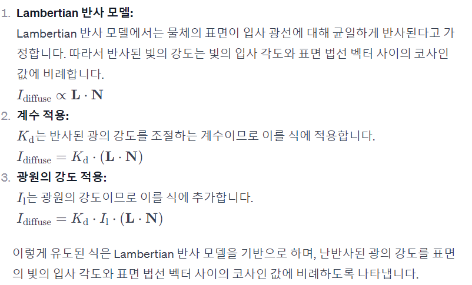

#### Gouraud Shading과 Phong Shading의 각각의 장단점을 쓰라

Gouraud Shading은 계산이 효율적이고 부드러운 표면을 제공하지만, 광택 효과에 한계가 있습니다.
Phong Shading은 광택 모델링이 우수하나 계산 비용이 높고 부정확한 색상 변화가 발생할 수 있습니다.

그라우드는 각 vertex에 대해 Phong Model을 적용하지만, Phong Shading은 각 Fragment에 대해 적용하기에 이런 트레이드 오프가 발생

#### 다음 그림과 같이 물체의 외곽선(실루엣: silhouette)을 구별하여 검은색으로 칠하고 싶다. 외곽선 부분인지 파악 할 수 있는 방법을 간단히 제시하라

#### 구(sphere)위에 texture mapping을 수행하려 한다. 다음 그림과 같이 구 위의 한 점 P 가 주어졌을 때 이 점의 텍스쳐좌표  (u,v)를 구하라.(구의  반지름은  1로  가정하라)

$$ p(p_x, p_y, p_z) $$

v의 경우 미리 정의된 값을 사용하고 u의 경우 아래 공식을 통해 계산한다.

$$ \phi = sin^{-1}\frac{p_y}{r} $$

$$ v = \frac{\phi}{\pi} + \frac{1}{2}$$

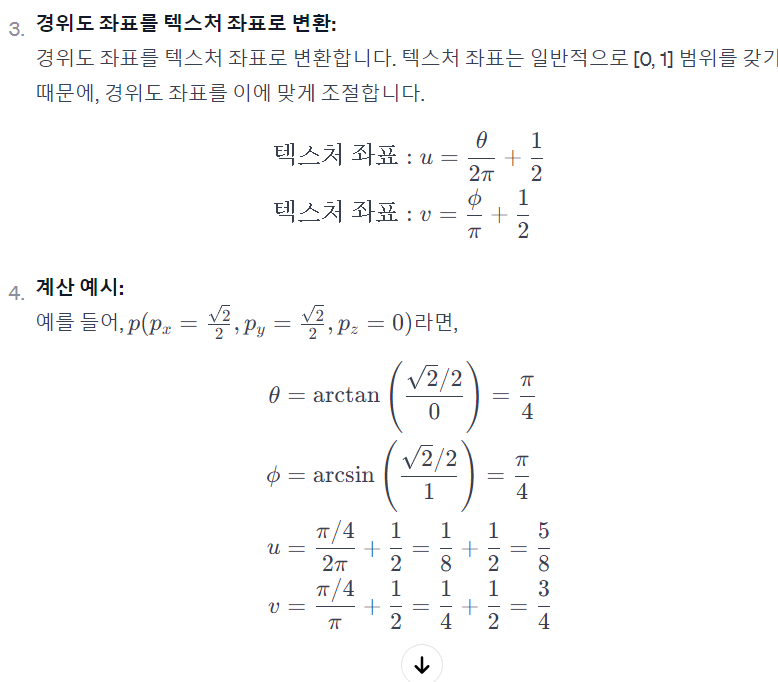

#### Perspective Transform Matrix는 일반적으로 2개의 변형 행렬의 순차적인 적용(곱)을 통해 구한다. 그 2개의 변형이 무엇인지 그 역할에 대해 간단히 쓰라

뷰 변환(View Transformation) 행렬과 투영 변환 행렬(Projection Transformation Matrix)

뷰 변환 모델 좌표계에서 카메라 좌표계로 바꾸는 행렬로 지정한 시야각, far 를 통해 표현할 객체만 표현한다.

투영 변환 행렬은 카메라 좌표계에서 정규화된 좌표계로 변환하는데 이 과정에서 unhinging이 일어난다.

#### 다음과 같은 삼각형의 세 점의 좌표 P0, P1, P2가 주어졌을 때 이 삼각형의 normal vector n을 구하는 방법을 제시하라

$$ n = (p_1 - p_2)(p_0 - p_2) $$

#### Gouraud Shading에 대해 설명하고, 어떤 장/단점이 있는지 간략히 쓰라

Gouraud Shading는 각 정점의 색을 계산하고 이를 보간하여 모든 픽셀에 색을 할당하는 것이다.

Gouraud Shading는 Vertex에 대해 Phong Model을 적용하는 것으로 Phong Shading에 비해 빠르다는 장점이 있다.

하지만 모서리나 꼭지점에 대한 처리가 빛 반사처리의 정확한 처리가 어렵다.

#### 카메라에서 사용하는 focal length라는 용어의 정의에 대해  간략히  제시하고, 이 값이 클 때와 작을 때 OpenGL에서 사용하는  Field of View(FOV) 값은 각각 대강 어떻게 변하게 되는 지 설명하라

- 용어의 정의: focal length란, 렌즈의 초점 거리를 나타내며, 찍을 대상의 초점을 맞추는 것으로 초점 거리가 길면 먼 곳의 이미지를 찍을 때, 작으면 축소의 개념으로 이해한다. OpenGL에서는 FOV로 나타내며, 시야각을 뜻한다. 사용자가 볼 화면의 범위를 결정한다.

- Focal Length가 클 때, 작을 때의 상관관계 : 초점 거리가 커지면 상대적인 거리가 감소하므로 확대효과가 나타난다. fov 값이 작아지게 되며 시야각이 좁아지게 된다. 즉 화면에 나타나는 영역이 줄어듬 (멀리 있는 물체를 볼 때 눈을 찡그리는 행위) 반대로 작을 땐, 물체의 상대적인 거리가 증가하므로 확대 효과가 감소한다. fov값은 커지면서 시야각 또한 증가한다.

#### 카메라가  월드좌표계(world  coordinate)에서  다음과  같은  상태로  주어졌을  때,  월드좌표계를  카메라좌표계(camera coordinate)로  변환하는  4x4 transform matrix를  직접  구하여라

#### 다음 그림과 같이 모델의 silhouette에 검은 색을 칠해서 그림(만화)  같은 효과를 줄려고 한다. 어떻게  구현하면  되겠는가?  간단히  설명하라

#### Texture mapping을 위한 텍스쳐 좌표를 할당하는 방법으로 cylindrical mapping을 적용하려 한다. 다음과  같은 3차원 원통 위의 한 점 p(x,y,z)가 주어졌을 때 이 점의 2D texture 상의 좌표인 (u, v)는 어떻게 될 지 계산하여 보라. 

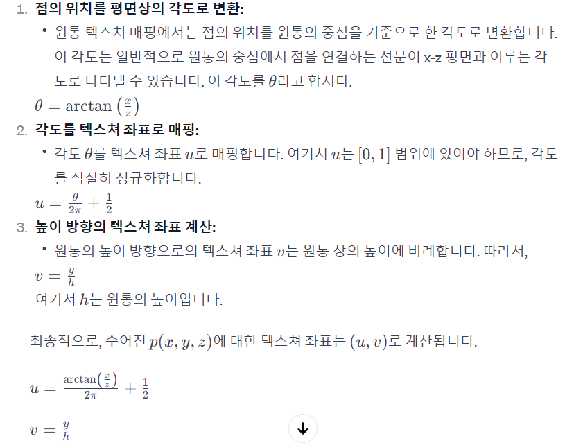

#### Fresnel Effect란 무엇인지 “결과적으로 보여지는 시각적인 현상”을 중심으로 설명하라

Fresnel Effect(프레넬 효과)는 광학적인 현상 중 하나로, 물체의 표면에서 입사광이나 관측광의 각도에 따라 물체의 외부와의 경계 부분에서 반사되는 빛의 양이 달라져 시각적인 현상으로 나타나는 효과를 의미합니다.

이 효과는 물체 표면에서의 빛 반사가 입사광과 관측광의 각도에 따라 변화함에 따라 발생합니다. 일반적으로 입사각과 퇴사각(관측각)이 작을 때(평행할 때) 반사되는 빛의 양이 높아지며, 입사각과 퇴사각이 클 때(수직에 가까울 때) 반사되는 빛의 양이 감소합니다.

Fresnel Effect는 주로 투명하거나 반투명한 물체의 표면에서 나타나며, 유리, 물, 얼음 등의 물체에서 두드러지게 나타납니다. 이러한 효과를 통해 물체의 표면이 입체적으로 보이고 광학적인 재현력을 높일 수 있습니다.

결과적으로, 관측자가 물체를 바라보는 각도에 따라 물체의 외부와의 경계 부분에서 반사되는 빛의 강도가 변함에 따라, 표면이 더 생생하게 보이고 입체적인 느낌을 줍니다. 이는 현실에서도 많은 물체의 표면에서 나타나는 현상으로, 컴퓨터 그래픽스나 시각 효과에서도 자연스로운 물체 표면을 모델링하는 데에 활용됩니다.

#### Bump mapping 을 적용함에 있어 Tangent vector가 필요한 이유에 대해 간단히 설명하라.

Bump Mapping은 표면의 마찰, 불규칙성, 혹은 입체적인 높낮이를 표현하기 위한 기술 중 하나입니다. 이 효과를 얻기 위해 Normal Map을 사용하는데, 이때 Tangent Vector(접벡터)가 필요한 이유는 텍스쳐의 높이 정보를 표현하기 위해서입니다.

Normal Map은 각 픽셀의 표면에서의 노멀 벡터를 텍스쳐로 저장한 것이며, 이 노멀 벡터는 텍셀의 로컬 좌표계(Local Coordinate System)에서 표현됩니다. 따라서 Bump Mapping을 적용하기 위해서는 텍셀의 로컬 좌표계에서의 노멀 벡터를 월드 좌표계로 변환해야 합니다.

이때 Tangent Vector가 필요한데, Tangent Vector는 텍셀의 표면에서 가로 방향의 벡터를 나타내며, 이를 통해 노멀 벡터를 월드 좌표계로 변환할 수 있습니다. Tangent Vector는 텍셀의 로컬 좌표계에서 노말 벡터와 수직이면서, 바이노멀 벡터와 함께 로컬 좌표계를 이루는 벡터입니다.

따라서 Tangent Vector가 없으면 텍셀의 로컬 좌표계에서 월드 좌표계로 노멀 벡터를 올바르게 변환하는 것이 어려워집니다. Tangent Vector를 사용하면 텍셀의 표면의 방향을 적절하게 고려하여 노멀 벡터를 월드 좌표계로 매끄럽게 변환할 수 있습니다. 이렇게 하면 Bump Mapping을 통해 입체적이고 디테일한 표면 효과를 얻을 수 있습니다

#### parallax mapping(또는 relief mapping)이 기존의 bump mapping 과 비교해 그 결과물에서 어떤 시각적 차이를 만들어 내는 지 간단히 쓰라.

Parallax Mapping 또는 Relief Mapping은 Bump Mapping과 비교했을 때 입체적인 표현에서 차이를 만들어냅니다. 여기에는 시각적 효과에서의 주요 차이점이 있습니다.

입체적인 표현의 차이:

Bump Mapping: Bump Mapping은 텍스쳐를 사용하여 표면의 높낮이를 가짜로 나타내는 효과를 주는 기술이지만, 실제로 표면은 평평합니다. 그렇기 때문에 광원의 입사각에 따라 빛이 반사되는 정도는 달라질지라도 표면의 입체적인 구조는 없습니다.
Parallax Mapping: Parallax Mapping은 실제로 텍스쳐 좌표를 조절하여 텍스쳐를 통해 입체적인 높낮이를 시뮬레이션합니다. 이로써 물체 표면이 실제로 튀어나오거나 들어간 듯한 입체감을 제공합니다.
시점 변화에 따른 효과:

Bump Mapping: 시점에 따라 텍스쳐의 입체적인 효과가 변하지 않습니다. 즉, 시점 변화에 따른 입체 효과가 부족합니다.
Parallax Mapping: 시점 변화에 따라 텍스쳐의 입체 효과가 변하므로, 뷰어가 텍스쳐에 더 가깝게 다가갔을 때 실제로 들어가는 것처럼 입체적인 효과가 느껴집니다.
성능 차이:

Bump Mapping: 비교적 가벼운 연산으로 구현 가능하여 성능이 우수합니다.
Parallax Mapping: 추가적인 계산이 필요하므로 상대적으로 더 높은 연산 비용이 들 수 있습니다. 그러나 높은 품질의 입체 효과를 제공합니다.
Parallax Mapping은 Bump Mapping에 비해 시각적으로 더 풍부한 입체감을 제공하며, 텍스쳐의 입체적인 표현을 높일 수 있습니다. 그러나 연산 비용이 높아질 수 있기 때문에 성능 상의 고려가 필요합니다.

