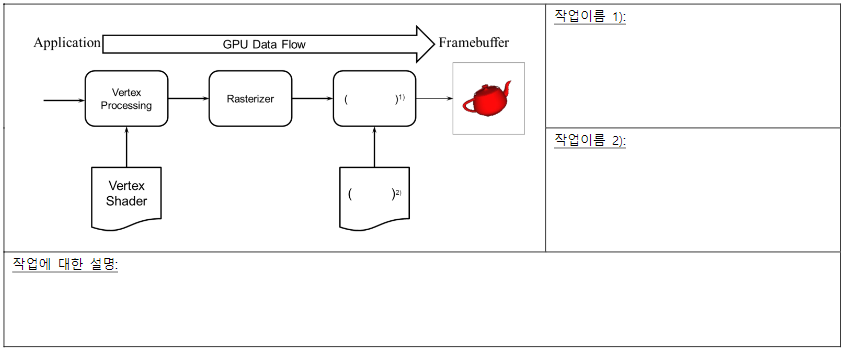

# 중간고사 문제 풀이

## 2016

### 1. 컴퓨터로 3차원 물체를 그리는 대표적인 방법으로 Ray Tracing이라는 방법이 있다. 이 방법이 무엇인지 간략히 설명하고, 이 방법이 갖는 장점과 단점을 쓰라.

- Ray Tracing의 의미
  - 빛을 쏘고 반사되는 과정을 계산하는 것으로 실제 세계의 물리적인 빛의 반사를 컴퓨터로 표현하는 것
  - 실제 세상에서는 단일 반사가 아닌 여러 반사가 복잡하게 이뤄지는데 이를 컴퓨터로 표현은 가능하지만 그 수가 기하급수로 늘어나기에 불가능에 가깝다.
  - 따라서 이를 흉내내는 기술이 발달하게 되었다.
  - 모든 빛을 계산하는 것이 아닌 시야각에서 빛을 쏘고 반사되는 과정을 계산한다. 이를 역추적이라고 한다.
- 장점
  - 실세계와 같은 표현이 가능하다.
- 단점
  - 사실적인 표현이 증가할수록 계산량이 기하급수적으로 증가한다. (표현하는 시간이 오래걸린다.)

### 2. 다음은 간략화된 그래픽스 파이프라인이다. 빈 칸 2곳에 들어가야 할 작업 과정이 무엇인지 각각 쓰고, 이 과정의 목적이 무엇인지 아래 칸에 간략히 설명하라

