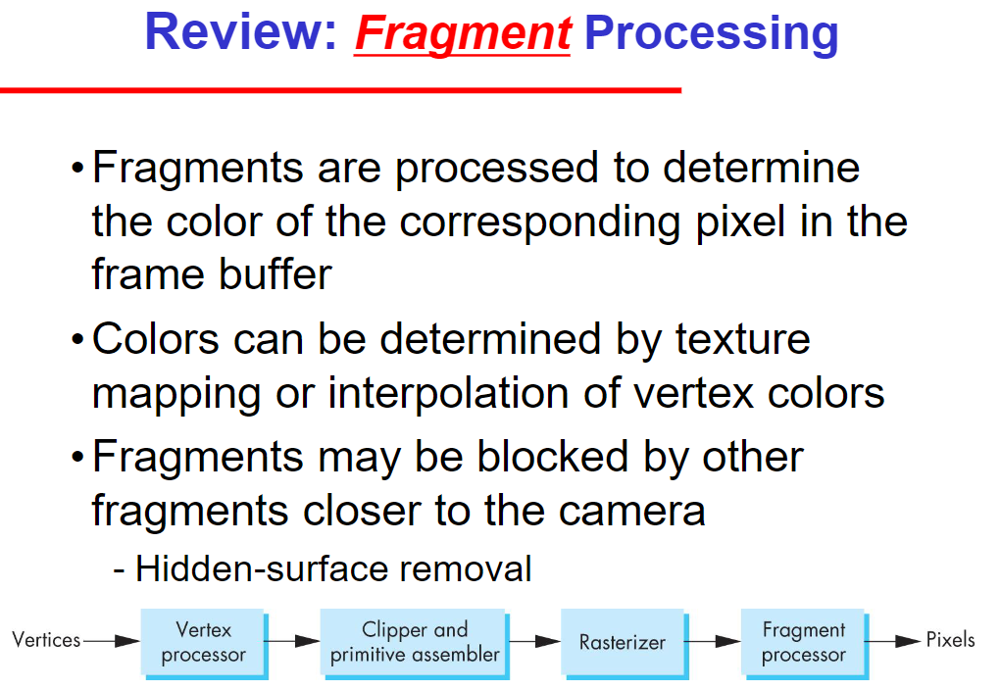
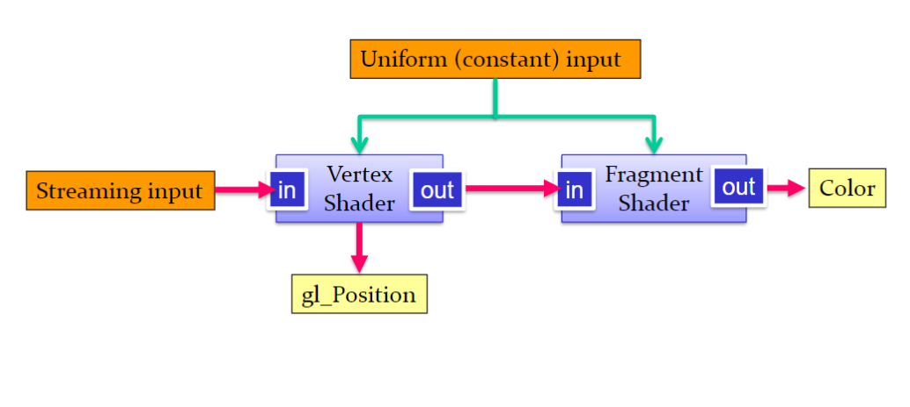
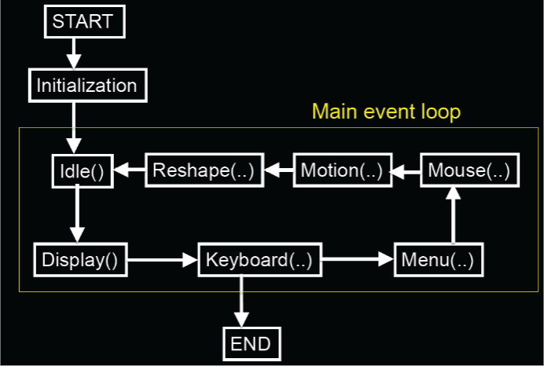

# LectureNote

## CG01

- 컴퓨터 그래픽
  - 컴퓨터 그래픽은 모델링, 렌더링, 애니메이션을 다룸
  - 모델링은 단순하게 데이터로 존재
  - 이후 빛과 광원을 계산하여 표면에 그려내는 것이 렌더링

- 컴퓨터 상의 모든 시각 정보는 표면으로 표현 surface

1차방정식, 2차방정식으로 다양하게 다루는데 가장 간단한 폴리곤 모델(삼각형으로 다룸)

카메라(시야)로 부터 2d화면을 보기까지 3d물체를 화면 어디에 위치시키는지 계산하는 것 *표면으로*

- 쉐이딩: 빛의 반사를 계산하는 것
  - 빛을 쏘고 해당 빛이 반사되는 좌표를 계산

레이어 순서, 그리고 명암도 계산에 들어가야함

재질(머터리얼)은 빛을 어떻게 반사할지 결정

- 빛은 간접광과 직접광이 있음
  - 직접광은 단순하게 그려낼 수 있다.
  - 하지만 간접광은 빛이 반사되는 과정을 계산해야함 (이에 알고리즘이 필요)
  - ex) 단순 해변의 햇빛을 받는 과정은 계산이 명로하지만 강의실내 면으로 된 여러 전등에 의한 간접광은 계산이 힘듬

수업은 OpenGL로 실습.

## GC02

- 물체를 그리기 위해 필요한 정보
  - 카메라 정보, 시각 정보(위치, 원근감): Viewer
  - 조명 정보(빛의 위치, 색상, 세기): Light Source
  - 물체 정보(물체의 위치, 모양, 재질): Objects
  - ++ Attributes(Material, Texture, Transparency, ...)

- OpenGL은 위 정보를 쉽게 다룰 수 있도록 도와줌

모든 시작은 광원에서 시작 -> 빛에서 광자가 나오고 이 광자가 물체에 반사되어 눈에 보이는 것

- 빛이 물체를 만나면 일어나는 3가지
  - 반사: 빛이 물체에 반사되어 눈에 보이는 것
  - 투과: 빛이 물체를 통과하여 눈에 보이는 것
  - 흡수: 빛이 물체에 흡수되어 눈에 보이지 않는 것
    - 여기서 흡수는 빨간색 물체가 있다고 한다면 나머지 색상을 흡수하고 빨간색만 반사하는 것
    - 즉, 색을 가지는 것이 흡수

### Ray Tracing (매우 중요)

- 빛을 쏘고 반사되는 과정을 계산하는 것

실제 세상의 경우 빛에서 발원한 광자가 물체에 반사되는데 이때 단일 반사가 아닌 여러 반사가 일어남

이를 컴퓨터로 표현은 가능하지만 그 수가 매우 기하급수적으로 늘어나기 때문에 불가능

따라서 이를 흉내내는 기술이 매우 발달하게 되는데 이것이 컴퓨터 그래픽의 핵심

실제 물리적인 빛의 반사를 컴퓨터로 표현하게 되면 매우 느리고 많이 무겁다.

대신 좀 더 사실적인 표현이 가능 -> 거울에 여러 다반사로 인해 연속적인 비침, 굴절 등등

매우 무겁기 때문에 이를 흉내내기 위해 실제 시야각(초점)에서 빛을 쏘고 반사되는 과정을 계산(역추적)

따라서 이런 실제 세상을 흉내내기 위한 야매?적인 방법이 생기게 되는데

초창기 가장 혁신적인 형태의 레이트레이싱은 스트리밍 방식이다.


- Pipeline architecture
  - Vertex Processor: 3D object -> 2D image
    - 3D object를 2D image로 변환
    - 화면의 정보를 점으로 읽음
    - 꼭지점을 읽음
  - Clipper and Primitive Assembler: 2D image -> Primitives
    - 점을 선으로 연결, 주어진 도형 가장 많이 삼각형으로 사용
  - Rasterizer: Primitives -> Fragments
    - 선을 삼각형으로 채움
  - Fragment Processor: Fragments -> 2D image
    - 삼각형을 채워서 2D image로 변환
    - 삼각형의 내부를 채워서 색을 채움

이 과정을 스트리밍으로 진행하여 메모리 문제를 해결

1980년대 후반에 픽사가 이 기술을 사용하여 애니메이션을 제작

하지만 고질적인 빛 문제를 해결하지 못한

여기서 보여지는 기술인 야매적인 방법으로 면의 형태를 읽어 빛이 반사되는 과정을 계산

즉, 벡터로 면의 방향을 읽어 외적, 내적을 통해 빛이 반사되는 과정을 계산

실제로 해당 영상을 보면 간접광이 없이 빛이 하나로 이어지고 면의 색이 일정함 즉, 어색함

## GC03

### 복습

- Vertex 꼭지점을 읽음 이 과정이 Projection
- Rasterization: 칠해야할 픽셀들, 점들 -> Fragment
  - 각각의 점마다 색을 결정함 이 과정을 -> Fragment Processing
  - Fragment Processing: Fragment -> 2D image
    - 색을 결정하는 과정
    - 여기서 빛의 반사를 계산하는 것이 중요
    - 꼭지점으로 이뤄진 삼각형의 색을 결정하는 것이다.

위의 연산은 벡터, 행렬 연산 즉, 실수 계산으로 이뤄짐

이 계산을 얼마나 빠르게 하느냐가 속도에 영향을 줌



병렬처리에 매우 적합

CPU는 더 복잡한 연산을 수행(메모리 관리, 프로그램 실행 등등) 대부분의 컴퓨터가 4~16개가 있다.

CPU는 비용이 쎄서 이를 대체하기 위해 GPU가 등장

GPU는 병렬처리에 매우 적합하다.

단순한 일 처리에 적합

초창기엔 Graphics processor라고 불렸다.

하지만 발전에 따라 Vertex Processor, Fragment Processor를 직접 프로그래밍할 수 있게 되고

좀 더 많은 일을 담당하게 되었다.

### OpenGL

*OpenGL을 사용하기 앞서 말한 행렬을 반환하는 기능들을 담고 있는 라이브러리*

강의 교안에 따라 설치작업

*개인적으로 Vscode 사용법 알아오기*

## GC04

## GC06

## GC07

쉐이더는 GPU의 계산에 따라 보이는 위치, 색 등을 결정할 수 있다.

Vertex Shader: Vertex Processor

Fragment Shader: Fragment Processor

OpenGL의 쉐이더는 GLSL이라는 언어로 작성

- C언어와 유사
  - 하지만 동적할당, 재귀, 다이나믹 등등은 제한
- 빌트인 수학, 벡터, 행렬 연산등의 함수가 있음
  
모든 쉐이더는 main함수를 가지고 있어야함

```c
void main(void) {
  ...
}
```

### GLSL Data Types

- float, int, bool
- vec2, vec3, vec4 (float vector)
- ivec2, ivec3, ivec4 (int vector)
- bvec2, bvec3, bvec4 (bool vector)
- mat2, mat3, mat4 (float matrix)
- sampler2D (texture)

생성자처럼 사용 가능함

```c
vec3 v = vec3(1.0, 2.0, 3.0);
```

또한 벡터 데이터는 다음과 같이 접근 가능

- x, y, z, w
- r, g, b, a
- s, t, p, q
- 배열과 같이 [0]...

```c
vec3 v = vec3(1.0, 2.0, 3.0);
v.x = 4.0;
v[1] = 5.0;
```

### GLSL Matrix

- mat2, mat3, mat4

```c
mat2 m = mat2(1.0, 2.0, 3.0, 4.0);

// [1.0, 2.0]
// [3.0, 4.0]
```

실제로 선형대수학을 컴퓨터에 맞게 사용하려면 row-major가 아닌 column-major로 사용해야함

### GLSL Example

```c
#version 330

uniform	float uTheta1;
uniform	float uTheta2;

in vec4 vPosition;
in vec4 vColor;

out vec4 color;

void main()
{
	float rad1 = uTheta1 / 180.0 * 3.141592;
	mat4 m = mat4(1.0);
	m[0][0] = cos(rad1); m[1][0] = 0; m[2][0] = sin(rad1); m[3][0] = 0; 
	m[0][1] = 0; m[1][1] = 1; m[2][1] = 0; m[3][1] = 0;
	m[0][2] =  -sin(rad1); m[1][2] = 0; m[2][2] = cos(rad1); m[3][2] = 0;
	m[0][3] = 0; m[1][3] = 0; m[2][3] = 0; m[3][3] = 1;

	float rad2 = uTheta2 / 180.0 * 3.141592;
	mat4 n = mat4(1.0);
	n[0][0] = 1; n[1][0] = 0; n[2][0] = 0; n[3][0] = 0; 
	n[0][1] = 0; n[1][1] = cos(rad2); n[2][1] = -sin(rad2) ; n[3][1] = 0;
	n[0][2] = 0; n[1][2] = sin(rad2); n[2][2] = cos(rad2); n[3][2] = 0;
	n[0][3] = 0; n[1][3] = 0; n[2][3] = 0; n[3][3] = 1; 
	
	gl_Position = m*n*vPosition;

	color = vColor;
}
```

이 쉐이더 코드에서 in, out은 다음과 같이 사용

- in: Vertex Shader -> Fragment Shader
- out: Fragment Shader -> Frame Buffer

즉 넘겨주는 역할



여기서 gl_Position은 Vertex Shader의 내장 변수로 Vertex Shader의 결과를 저장하는 변수

Uniform은 CPU에서 GPU로 데이터를 전달하는 역할

즉 실제 코드에서 쉐이더관련을 직접 제어하기 좋음

## GC08

### 복습

- uniform: CPU -> GPU
  - 쉐이더코드에서 작성한 변수를 main에서 사용하기 위해 사용

- myDisplay() 화면에 그릴 때 마다 호출되는 콜백함수

V쉐이더에서 각 꼭지점으로 삼각형으로 만들어서 f쉐이더로 넘겨준다.

이후 f쉐이더는 이후 만들어진 삼각형 내부의 픽셀들을 채워준다.

그 값들은 각 꼭지점에서 보간된다.

### z - buffer

- z-buffer는 깊이 버퍼라고도 함

화면에서 z축으로 그려야 하는 레이어 순위 정도로 생각

현재 그려진 삼각형의 깊이를 기억하는 용도로 사용

원래 그점에 그려진 z값보다 가깝다면 그리고 아니면 x

```c
	glutSwapBuffers();

  	glutInitDisplayMode(GLUT_DOUBLE | GLUT_RGBA | GLUT_DEPTH);
```

여기서 컬러버퍼와 깊이버퍼는 한 세트지만 더블 버퍼로 선언한 이유는

실제 깜빡임을 없애기 위한 것으로 한 버퍼에 컬러와 깊이를 백보드에서 그리고 이후 실제 화면에 보이는 버퍼와 swap한다.

### glut

지금까지 작성한 그림을 그리는 함수는 gl로 시작하지만 플랫폼의 허락을 받아야 하는 함수는 glut로 시작한다 (glutInitDisplayMode)

glutMainLoop()는 화면에 그려야 할 때마다 호출한다.

Idle -> Display -> ..

이벤트 콜백이라고 함

즉, 이벤트에 함수를 등록하면 해당 이벤트에 그 함수가 호출



이외에도 다양한 이벤트가 있음

## GC09

## GC10

## GC11

- 벡터 연산
  - 더하기, 빼기, 내적, 외적, 크로스, 닷 등등

벡터로 직선을 표현하는게 가장 안전하고 편함

직선을 표현하는 방법은 두가지가 있다.

- 점과 벡터
  - 점과 방향벡터
  - 점과 점
    - 두 점을 잇는 벡터

### 벡터의 내적

*Dot Product*

두 벡터가 얼마나 비슷한 방향을 가지고 있는지를 나타내는 값

- cross product는 두 벡터가 얼마나 수직인지를 나타내는 값

## GC12

행렬로 표현하게 되면 복잡한 과정들을 하나의 행렬로 표현 가능하다.

*더 다양한 방법이 있지만 행렬을 사용한다.*

회전, 반사, 기울이기 등이 가능하다. (3x3)

이동은 행렬에 상수를 더하는 것, 즉(1을 추가함)

행렬의 크기가 1 커지게 된다.

이동은 4x4 행렬을 사용한다.

벡터 행렬의 4번째 값은 1로 고정,

1이 아닌값이 들어오면 w로 인식하고 이를 동차좌표계라고 한다.

x, y, z의 값을 w로 나눈 값이 실제 좌표값이 된다.

- 0, 0, 0, 0은 없다.
  - 0, 0, 0, 1이 원점

[0][3]에 이동할 값을 넣어주고

[3]행에는 0, 0, 0, 1 값을 넣어 1을 고정해준다.

### 원점이 아닌 다른 점을 중심으로 회전

피봇을 원점으로 옮기고 회전을 시킨 후 다시 원래 위치로 옮기는 것

`T(x, y)Rz(θ)T(-x, -y)` 이렇게 표현

뒤에서 부터 읽어야함

### Affine Transformation

어떤 사각형을 주게 되면 이를 평행사변형으로 만들어주는 것

Affine Transformation에서 특이한 변화를 강체변형이라고 한다.

크기와 부피를 변형하지 않고 방향과 위치를 변형하는 것

*이동과 회전만 있는 경우*

++

4x4 행렬에서 3x3은 회전을 담당하는데 해당 행렬의 역행렬은 전치행렬이다.

즉, 회전 행렬과 역행렬의 곱은 항상 단위행렬이다.

역시나 행렬과 전치행렬의 곱은 항상 단위행렬이다.

행렬식(det)는 부피변화를 나타내는데 값이 음수라면 부피가 반대로 변화한다. 즉, 미러링

3차원에서 회전행렬은 SO(3)이라고 한다.

이는 행렬식이 1이고 역행렬이 전치행렬인 행렬을 의미한다.

orthogonal: 직교하는(공통점이 없다.)

회전 벡터는 orthogonal normal

### 임의의 좌표 3차원 회전

3차원에서는 u라는 회전축과 벡터가 있다고 할 때

회전축을 잘 돌리면 x, y, z축으로 만들 수 있다.

즉, 임의의 방향을 회전하고 싶다면 회전축을 x, y, z으로 만들고 u만큼 회전시키고 다시 원점으로 옮기면 된다.

과정은 x, y, z에서 3차원 좌표 상에서 원점을 기준으로 u만큼 회전한다면, x, y, z축에서 투영 가능하게 좌표값 하나를 0으로 두고 회전 값을 알 수 있다.

마찬가지로 한 좌표축에 수렴하도록 회전축을 회전시키고 다시 원점으로 옮기면 된다.

### 자유도

2차원 이동의 자유도는 2

3차원 이동은 3

3차원 회전은 3

회전은 순서가 중요..

### 오일러 앵글(Euler Angle)

회전은 숫자 3개가 필요, 자유도가 3

비행기의 예시 (피치, 요, 롤링)

피치: x축을 중심으로 회전

요: y축을 중심으로 회전

롤링: z축을 중심으로 회전

*가장 일반적이고 직관적인 방식*

- 짐벌이 가장 대표적인 예시

### 짐벌락(Gimbal Lock)

3차원 회전을 3개의 축으로 나누어 회전을 시키는데 이때 2개의 축이 일치하게 되면 짐벌락이 발생한다.

즉, 2개의 축이 일치하게 되면 자유도가 2가 되어 1개의 축만 회전하게 되는데 이때 2개의 축이 일치하게 되면 회전축이 1개가 되어 회전이 불가능하게 된다.

이를 해결하기 위해 쿼터니언을 사용한다.

++

2차원은 x, y로 표현

x제곱 + y제곱 = 1으로 각도의 유일성을 보장

3차원은 x, y, z로 표현

but 3차원 구는 불가능

### 쿼터니언(Quaternion)

쿼터니언이란, 4차원 벡터를 사용하여 3차원 회전을 표현하는 방법

## GC13

### Geometry Transformations

openGl 3차원 좌표가 2D 좌표로 변환되는 과정

로컬, 모델 좌표계에서 월드 좌표계로 이동 (Model Transform)

월드 좌표계에서 카메라 좌표계로 이동 (View Transform)

카메라 좌표계에서 화면 좌표계로 이동 (Projection Transform)

이 과정은 4x4 행렬로 표현된다.

화면 크기에 따라 달라지기 때문에 Normalized coordinate로 변환한다. (1x1)

#### Model Transform

물체를 가져다 놓는 것 (모양변화는 없다고 가정)

크기와 위치, 회전만 담당

scaling -> rotation -> translation 순으로 적용

```c
M = Translate(0,0,0) * RotateY(30) * Scale(1, 1.5, 1);
```

하나의 정보만 전해주고 이를 재활용하는 것을 인스턴싱이라고 한다.

*model transform을 instance transform이라고도 한다.*


#### View Transform


#### Projection Transform

## CG14

## GC15

## GC16

projection(투영)에는 두가지가 있다.

투영을 표현하기 위해선 카메라가 필요

- Simple Parallel Projections
  - 크기변화가 없이 그대로
- Simple Perspective Projections
  - 뒤에 있는건 작게, 앞에 있는 건 크게

### Projection

object coordinate -> Camera coordinate -> clip coordinate

즉, 프로젝션은 3D정보를 2D정보로 표현(3D정보를 버리지 않음)

한번 2D가 되면 3D를 되살릴 수 없다. (하지만 3D정보가 있어서 가능하긴 함)

4x4 행렬로 표현

### Parallel Projection(평행 투영)

같은 크기로 그리고 싶을 때 사용

평행투영은 현실에서 볼 수 없지만, 매우 멀리있는 경우 현실에서 일어남

ex) 망원렌즈 (아주 멀리있는걸 확대한 경우)

앞에 있는 물체와 뒤에 있는 물체의 크기차이가 없기 때문에 문제가 발생하기도 한다.

- Impossible Objects

건축, 게임, 특정 애플리케이션에서 사용

- Orthographic Projection(정사영, 수직투영)
  - z축을 0으로 만들어서 2D로 만드는 것
  - 다시 복구가 불가능하기 때문에 역행렬이 없다.
  - 하지만 앞 물체가 뒤 물체를 가려야 하기에 기술을 사용
  - z버퍼, z값의 범위가 필요(해상도)
    - 사용자가 보고 싶은 범위를 넣어주면 이를 컴퓨터가 재 스케일링하여 (1을 나눠서) 0~1사이의 값으로 만들어줌

> glOrtho(xmin, xmax, ymin, ymax, near, far)  
> x나 y를 다 주진 않음 종횡비를 맞추기 때문

- Normalized view volume

> Ortho(left,right,bottom,top,near,far)  

- 센터를 구하기 위해 left, right, bottom, top을 사용 2/1하여 센터를 구한다.
- 이후에 중심축으로 가져오고 스케일링을 한다.

z 값을 퀀타이전(양자화?)


